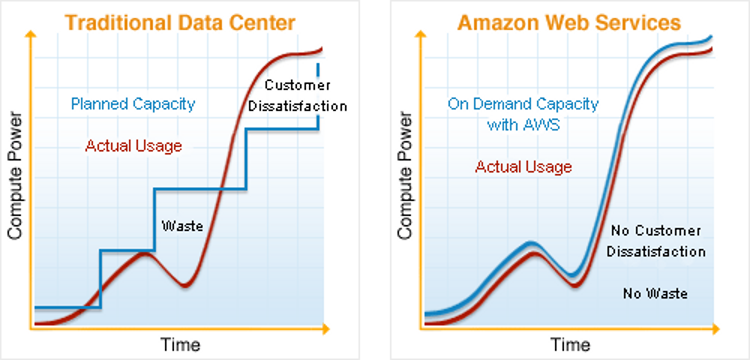
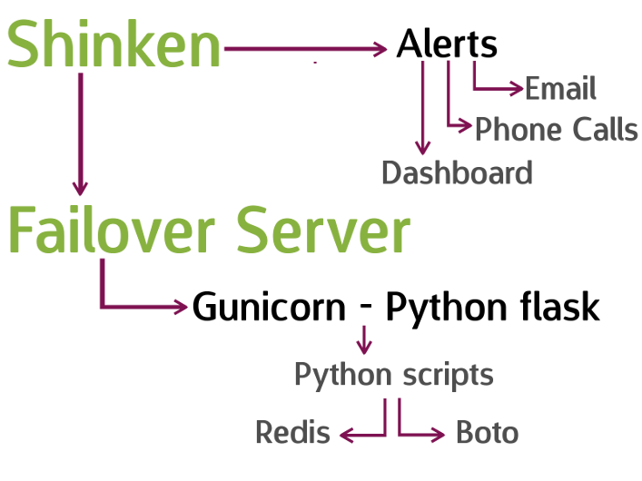

Managing AWS cloud with Python
==============================

 
 
 

** Rohit Gupta **
 
 
** Developer @plivo **
 
 
** @rohit01 **
 
 

.notes: 1 min. Say the topic

    

<h6> *AWS - <a href="http://aws.amazon.com" target="_blank">Amazon Web Service</a> </h6>

---
@rohit01
========

- ** FOSS enthusiast **
- ** Fedora Ambassador **
- ** Founded LUG, KGEC **
- ** Python lover **
- ** Cloud Architect @plivo **

.notes: 2 min. Dont look at slide. Seamless!

---

Agenda
======

- ** Cloud computing **
- ** Boto**
- ** Typical scenario: >>infrastructure **
- ** Problems associated **
- ** Solution **
- ** Boto code examples **

.notes: 1 min. Elaborate topics in full file

---

Cloud Computing
===============

- ** Evolving **
- ** Interesting clip: <a href="http://www.youtube.com/watch?v=AnxrJiS5uKU" target="_blank">Youtube</a> **
- - ** Cut from above video: <a href="https://www.dropbox.com/s/a7l9umaoi39hpz9/clip.mpeg" target="_blank">Dropbox</a> / <a href="http://dl.dropbox.com/u/78317387/pycon/clip.mpeg" target="_blank">Raw video</a> **

.notes: 5 min. Our knowledge of Cloud computing is very limited. Play the video

.notes: Future comparision

---
Benefits
========

 

.notes: 3 min. Traditional datacenters require frequent update. With AWS its just a matter of calling the API

 
 
<h6> Disclainder: <a href="http://aws.amazon.com/economics/?utm_source=AWS&utm_medium=website&utm_campaign=LP_below-the-fold" target="_blank">The above image is taken from AWS website</a></h6>

---
AWS Terminology
===============

- ** EC2 - Elastic Compute Cloud **
- - ** Seven regions **
- - ** Zones within regions **
- - ** Instance **
- - ** AMI - Amazon Machine Images **
- ** ELB - Elastic Load Balancer **
- ** S3 - Scalable Storage in the Cloud **
- ** Route 53 **

.notes: 5 min. 3 in US, 1 EU, 1 Singapore, 1 SA, 1 Tokyo

---
pip install boto
================

---
Launch instance
===============
    !python
    from boto.ec2 import connect_to_region
    def get_connection(region):
        conn = connect_to_region(
                region_name=region,
                aws_access_key_id='<AWS_ACCESS_KEY_ID>',
                aws_secret_access_key='<AWS_SECRET_ACCESS_KEY>'
        )
        return conn

    def launch_instance(region, ami_image_id):
        conn = get_connection(region)
        conn.run_instances(ami_image_id)

---

Typical scenario: >>Infrastructure
==================================
 

- ** 50 servers **
- ** 20 different types **

 

Manage cloud Resources !
========================

---
ps -ef | grep admin
===================

- ** Maintenance **
- ** 20 image ids (AMI id) **
- ** > 50 backups **
- ** Code updates **
- ** Monitoring **

---
| more
======

- ** Outages **
- ** ELB: load balancers **
- ** Auto-scaling **
- ** Failover **

---
Problem: Resource id's
======================
 

    !python
    def launch_instance(region, ami_image_id):
        conn = get_connection(region)
        reservation = conn.run_instances(ami_image_id)
        instance = reservation.instances[0]
        print instance.id

- ** instance.id: i-e9ovilp5 **
- ** ami_image_id: ami-80e915e9 **

---
Solution
========

- ** Create Roles for each server type **
- ** Tag Resources **

---
Solution
========

- ** Create Roles for each server type **
- ** Tag Resources **

 

Simplicity
==========

- ** Find resources **

---
Fetch AMI id
============
    !python
    def get_ami_id(region, role):
        conn = get_connection(region)
        my_images = conn.get_all_images(owners='<ACCOUNT_NO>')
        for image in my_images:
            if image.tags['role'] == role:
                return image.id
        return None

---
Fetch AMI id
============
    !python
    def get_ami_id(region, role):
        conn = get_connection(region)
        my_images = conn.get_all_images(owners='<ACCOUNT_NO>')
        for image in my_images:
            if image.tags['role'] == role:
                return image.id
        return None

Launch Instance
===============
    !python
    def launch_instance(region, role):
        conn = get_connection(region)
        ami_id = get_ami_id(region, role)
        reservation = conn.run_instances(ami_id)
        instance = reservation.instances[0]
        instance.add_tag('role', role)
        print 'Instance launched!'

---
Syntax: Resource Tagging
========================

- ** Get the Resource object from AWS using boto **
- ** Add the tag using the Syntax given below: **

  

# ** <resource_object\>.add_tag('<key\>', '<value\>') **

---
AWS Outage
==========

- ** Instance **
- ** EBS **
- ** DNS **
- ** ELB **
- ** API calls **

---
1 Minute; Every minute
======================

- ** Offline data store **
- ** Redis **
- ** Auto + manual failovers **

---
Failover
========

- ** Identify **
- ** Launch **
- ** Recover **

---
Chaos Monkey
============

---

---

Thank You
=========

 

** Rohit Gupta **
 
 
** Developer @plivo **
 
 
** Email: rohit@plivo.com **
 
 
** Ph: +91-8496035658 **
 
 
** Slide link: [https://bit.ly/plivoaws](https://bit.ly/plivoaws) **
 

