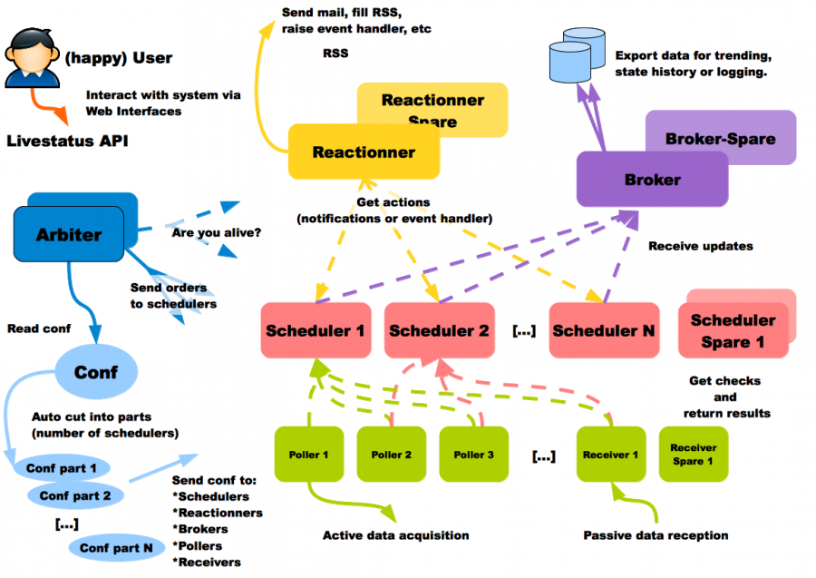

Build service dashboard using Shinken
=====================================

 
 
 
 
 

** Rohit Gupta **
 
 
** Developer @plivo **
 
 
** @rohit01 **
 
 

---
Why are we here?
================

- ** Monitor everything: Shinken **
- ** Shinken Architecture **
- ** NRPE Plugins **
- ** Write your own NRPE plugin **
- ** Automated service checks **
- ** Integrate your plugins **
- ** API based User Interface **

---
What is Shinken?
================

---
Shinken Architecture
====================

---

==================================================================================
<!--  -->

                      
<h4> *Reference: <a href="http://www.shinken-monitoring.org/wiki/the_shinken_architecture" target="_blank">http://www.shinken-monitoring.org/wiki/the_shinken_architecture</a> </h4>

---
NRPE Plugins
============

---
Write your own NRPE plugin!
===========================

---
Python NRPE Example
===================

    !python
    import requests
    import sys
    import time

    ST_OK = 0
    ST_WR = 1
    ST_CR = 2
    ST_CR = 3

    url = 'http://plivo.com'
    try:
        start_time = time.time()
        response = requests.get(url, timeout=2)
        end_time = time.time()
    except Exception:
        print 'Critical - Exception occured while fetching url: %s' url
        sys.exit(ST_CR)

---
Continue...
===========

    !python
    latency = end_time - start_time
    if response.status_code < 200 or response.status_code >= 300:
        print 'Critical - Response code: %s for url: %s' \
              % (response.status_code, url)
        sys.exit(ST_WR)
    elif latency > 1:
        print 'Warning - latency: %s secs for url: %s' % (latency, url)
        sys.exit(ST_WR)
    print 'Ok - %s tested successfully' % url
    sys.exit(ST_OK)

---
Things to Consider
==================

- Dont Re-Invent the wheel!
- Exit values
- Setup and Teardown
- Locks
- Exceptions
- Logs
- Be verbose but you have single line
- Graph everything

---
Integrate your plugins
======================

- ** Configuration DIR: ** /usr/local/shinken/etc/
- ** resource.cfg **

<pre>
$PYTHON_VENV$=/usr/src/python_env
$PLUGINSDIR$=/usr/local/nagios/libexec
</pre>

- ** commands.cfg **

<pre>
define command{
    command_name    my_web_check
    command_line    $PYTHON_VENV$/bin/python $PLUGINSDIR$/my_web_check.py
}
</pre>

- ** contacts.cfg **

---
Continue...
===========

- ** templates.cfg **

<pre>
# This is how critical call + email alerts are sent, 24x7 way.
define notificationway{
       notificationway_name                 email_and_call_alerts
       service_notification_period          24x7
       host_notification_period             24x7
       service_notification_options         c
       host_notification_options            d
       host_notification_commands           host_email_alerts
       service_notification_commands        service_email_and_call_alerts
}
</pre>

- ** pip install pyro **

---
Some Good Practices
===================

- Dont write for success scenarios
- Atomic checks
- Avoid mutual dependency
- Stats collection
- Avoid many hops
- Tricky for long running tests
- Be more verbose

---
API based User Interface
========================

---

---

Thank You
=========

 

** Rohit Gupta **
 
 
** @rohit01 **
 
 
** Developer @plivo **
 
 
** Email: rohit@plivo.com **
 
 
** Ph: (+65) 31583923 **
 
 
** Slide link: [http://bit.ly/plivosg](http://bit.ly/plivosg) **
 

